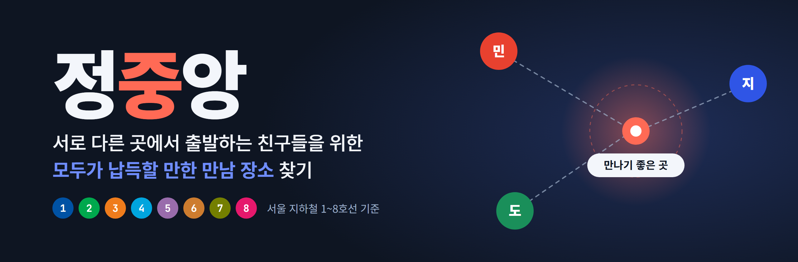
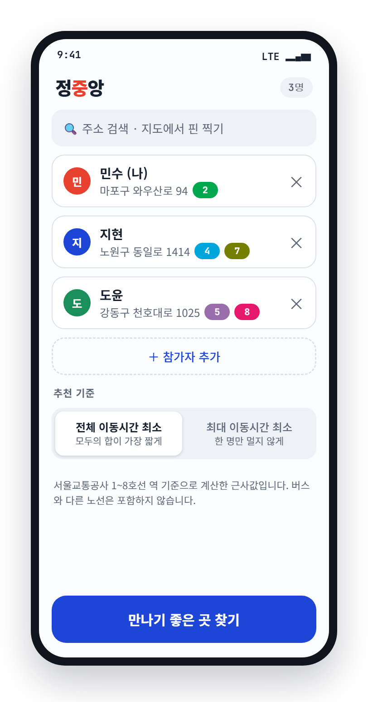
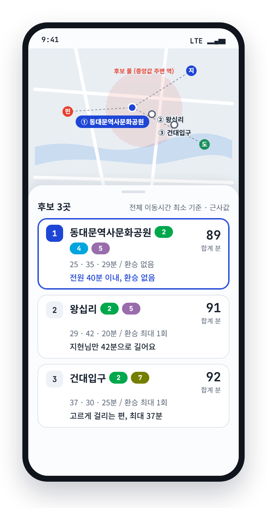
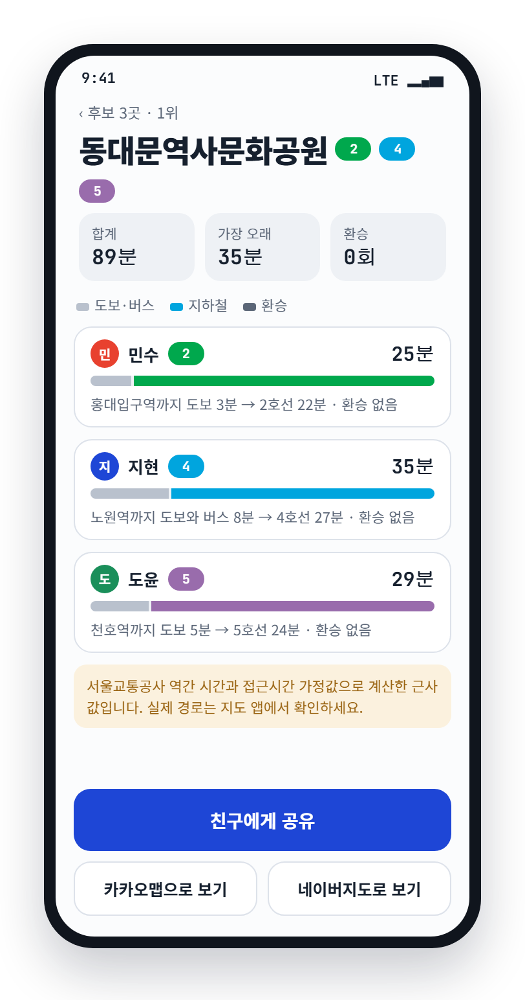
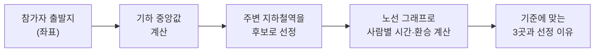
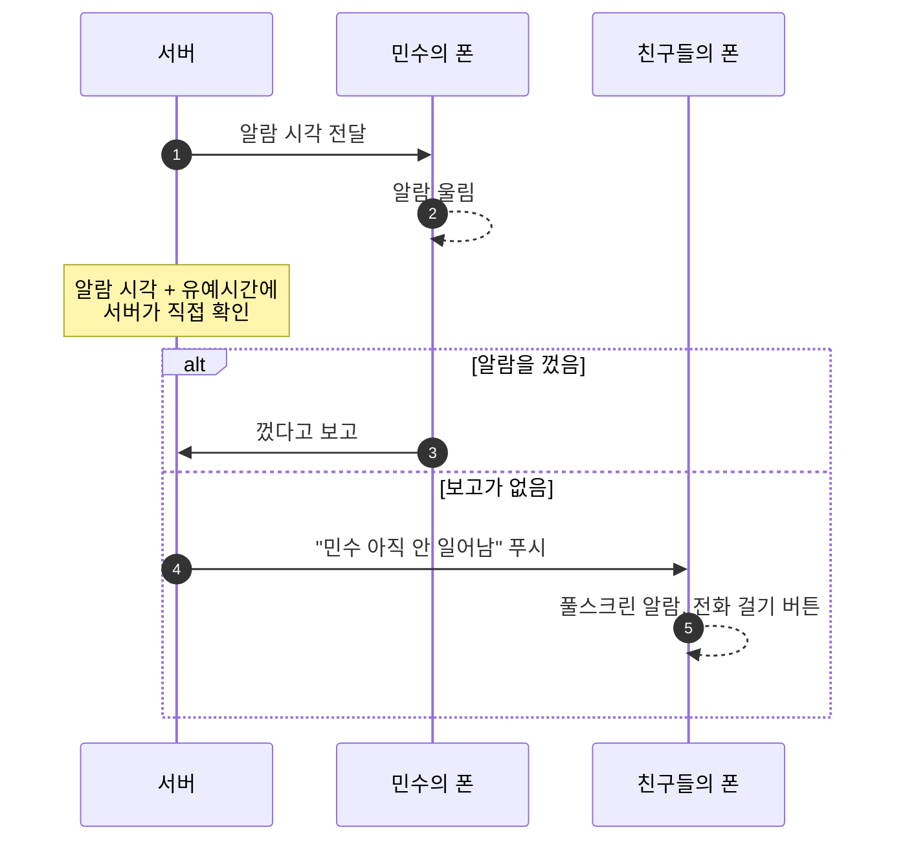

 

**[만든 이유](#만든-이유) · [사용 방법](#사용-방법) · [계산 방식](#계산-방식) · [책임 알람](#책임-알람) · [진행 상황](#진행-상황) · [개발자 정보](#개발자-정보)**

 

## 만든 이유

친구 셋이 약속을 잡습니다. 한 명은 홍대, 한 명은 노원, 한 명은 천호에 삽니다. 보통은 지도를 펴 놓고 "대충 중간이 어디지?" 하고 정합니다.

문제는 지도에서 가운데인 곳이 모두에게 가깝다는 보장이 없다는 점입니다. 직선거리는 비슷해도, 지하철로는 한 명만 환승을 두 번 하면서 한 시간을 가야 할 수 있습니다.

**정중앙은 지도상의 중간이 아니라, 지하철로 실제 얼마나 걸리는지를 기준으로 장소를 고릅니다.** 아래 예시에서는 세 사람이 각각 25분, 35분, 29분이면 닿는 동대문역사문화공원을 1위로 추천합니다.

 

## 사용 방법

<table>
  <tr>
    <td align="center" width="33%"></td>
    <td align="center" width="33%"></td>
    <td align="center" width="33%"></td>
  </tr>
  <tr>
    <td align="center"><b>1. 출발지 입력</b></td>
    <td align="center"><b>2. 후보 3곳</b></td>
    <td align="center"><b>3. 비교하고 공유</b></td>
  </tr>
  <tr>
    <td valign="top">한 사람이 모두의 출발지를 주소 검색이나 지도 핀으로 넣고, 추천 기준을 고릅니다.</td>
    <td valign="top">지도와 카드로 후보 3곳이 나옵니다. 사람별 시간, 환승 횟수, 선정 이유가 함께 보입니다.</td>
    <td valign="top">걷는 구간, 지하철 구간, 환승 구간을 사람별로 비교하고 카카오맵·네이버지도로 확인한 뒤 친구에게 공유합니다.</td>
  </tr>
</table>

> 화면 속 사람, 역, 소요시간은 모두 예시입니다. 아직 개발 중이라 설치해서 쓸 수는 없습니다.

추천 기준은 두 가지 중에 고릅니다.

| 기준 | 이럴 때 |
|:---|:---|
| **전체 이동시간 최소** | 모두의 이동시간 합이 가장 짧은 곳. 전체 부담을 줄이고 싶을 때 |
| **최대 이동시간 최소** | 가장 오래 걸리는 사람이 가장 짧은 곳. 한 명만 너무 멀지 않게 하고 싶을 때 |

 

## 계산 방식

1. 참가자 좌표들의 **기하 중앙값**(모든 사람까지의 거리 합이 가장 작은 점)을 구합니다.
2. 그 주변 지하철역을 후보로 뽑습니다.
3. 서울교통공사 공개 데이터로 만든 노선 그래프에서, 사람마다 출발지 근처 역부터 각 후보역까지 걸리는 시간과 환승 횟수를 계산합니다.
4. 고른 기준에 가장 잘 맞는 3곳을 선정 이유와 함께 보여 줍니다.

계산한 시간은 근사값이고, 화면에도 그렇게 표시합니다. 한계는 [알아둘 점](#알아둘-점)에 있습니다.

 

## 책임 알람

약속 장소와 시간이 정해지면, 사람마다 출발 알람을 자동으로 걸어 줍니다.

> **알람 시각 = 약속 시간 − 그 사람의 이동시간 − 준비 시간**

정해진 시간 안에 알람을 끄지 않으면 같은 약속 멤버 전원의 폰이 울리고, "○○ 아직 안 일어남" 알림과 함께 알람 끄기·전화 걸기 버튼이 뜹니다.

- 서버가 따로 시간을 재기 때문에, 늦잠 잔 사람의 폰이 꺼져 있거나 오프라인이어도 동작합니다.
- 약속 멤버 **전원이 동의했을 때만** 켜집니다.
- 안드로이드에서만 지원합니다.
- 자세한 설계는 [CLAUDE.md](CLAUDE.md)의 "확장: 책임 알람"에 있습니다.

초대 링크(친구들이 각자 자기 위치를 입력)와 약속 목적 필터(식사·카페·술자리)도 함께 추가할 계획입니다.

 

## 진행 상황

| 단계 | 내용 | 상태 |
|:---|:---|:---:|
| 1 | 추천 코어: 기하 중앙값, 서울 지하철 1~8호선 그래프(역 240개), 최단시간·환승 탐색, 가까운 역 검색, 접근시간 추정 | ✅ 완료 |
| 1 | 후보 3곳 선정(두 가지 추천 기준, 환승 우선 정렬)과 선정 이유 문구 (코어 전체 테스트 106개) | ✅ 완료 |
| 1 | 안드로이드 화면(입력, 후보, 상세), 지도, 공유 | 🔨 다음 |
| 2 | 초대 링크, 약속 목적 필터 (서버 도입) | ⏳ 예정 |
| 3 | 책임 알람 (서버 스케줄러, 로컬 알람, FCM, 실기기 테스트) | ⏳ 예정 |
| 이후 | 결제, 장거리, 다른 운영기관 노선 | 후순위 |

 

## 알아둘 점

| 항목 | 내용 |
|:---|:---|
| **지원 노선** | 서울교통공사 1~8호선만 지원합니다. 9호선, 신분당선, 분당선, 경의중앙선, 공항철도는 지원하지 않습니다. 1호선은 서울역~청량리 구간만 포함됩니다. |
| **버스** | 계산에 넣지 않습니다. 출발지에서 역까지의 접근 구간만 걷기·버스 가정값으로 추정합니다. |
| **소요시간** | 근사값입니다. 공개 데이터에는 정차시간이 빠져 있어 역마다 30초로 가정해 더했고, 출발지에서 역까지의 접근 시간도 가정값입니다. 실제 경로는 지도 앱에서 확인하는 걸 권장합니다. |
| **플랫폼** | 안드로이드 전용입니다. |

 

---

## 개발자 정보

### 기술 스택

| 영역 | 사용 |
|:---|:---|
| Android | Java(Kotlin 사용 안 함), XML + ViewBinding, MVVM + ViewModel + LiveData, ExecutorService/Handler |
| 지도·주소 | 카카오맵 SDK, 카카오 로컬 |
| 서버 (2단계~) | Spring Boot 3.5 / Java 17, Redis, Docker. 책임 알람부터 RDB(MySQL 또는 Postgres)와 FCM |
| 데이터 | 서울 열린데이터광장 CSV 3종(앱에 번들) |

### 폴더 구조

| 경로 | 내용 |
|:---|:---|
| `android/app/src/main/java/com/jeongjungang/domain/model` | `LatLng` |
| `android/app/src/main/java/com/jeongjungang/domain/geo` | `GeoMedian`(기하 중앙값), `GeoDistance` |
| `android/app/src/main/java/com/jeongjungang/domain/transit` | CSV 파서, 지하철 그래프, 최단시간 탐색, 접근시간 추정, 가까운 역 검색 |
| `android/app/src/main/java/com/jeongjungang/domain/recommend` | 후보 3곳 선정(`Recommender`), 추천 기준, 선정 이유 문구 |
| `android/app/src/main/assets/data` | 번들 CSV (역간 소요시간, 역사 좌표, 환승) |
| `android/app/src/test/java` | 단위 테스트와 실제 CSV 통합 테스트 |
| `backend` | Spring Boot 뼈대 (2단계 이후 사용) |
| `docs/DATA.md` | 데이터 출처와 파싱 주의점 |
| `docs/mockup`, `docs/images` | UI 시안 HTML과 README용 이미지 |
| `CLAUDE.md` | 프로젝트 규칙과 설계 |

### 개발 환경

- JDK 17
- 백엔드: `cd backend && ./gradlew build` (Windows는 `gradlew.bat build`)
- 안드로이드: Gradle 프로젝트 파일(`build.gradle`, `AndroidManifest.xml` 등)이 아직 없습니다. Android Studio에서 프로젝트를 만든 뒤 `android/app/src`의 소스를 옮길 예정입니다. 코어 코드는 Android 의존성이 없어서 JUnit4만으로 테스트할 수 있습니다.
- README 이미지 원본은 [`docs/mockup/ui-mockup.html`](docs/mockup/ui-mockup.html)(화면 시안)과 [`docs/mockup/banner.html`](docs/mockup/banner.html)(배너)이며, Chrome headless로 캡처했습니다.

API 키(카카오, ODsay, FCM 서버 자격증명 등)는 저장소에 두지 않습니다. 환경변수나 `local.properties`로만 주입하고, 외부 API 키가 필요한 호출은 서버를 거칩니다.

### 데이터 출처

지하철 데이터는 [서울 열린데이터광장](https://data.seoul.go.kr)의 서울교통공사 제공 자료이며 **공공누리 1유형(출처표시)** 입니다.

- 서울교통공사 역간 거리 및 소요시간 정보
- 서울교통공사 1-8호선 역사 좌표(위경도) 정보
- 서울교통공사 환승역거리 소요시간 정보

기준일과 가공 내용은 [docs/DATA.md](docs/DATA.md)를 보세요.

 

준하가똥마렵데 - 참 슬픈 일이구나

