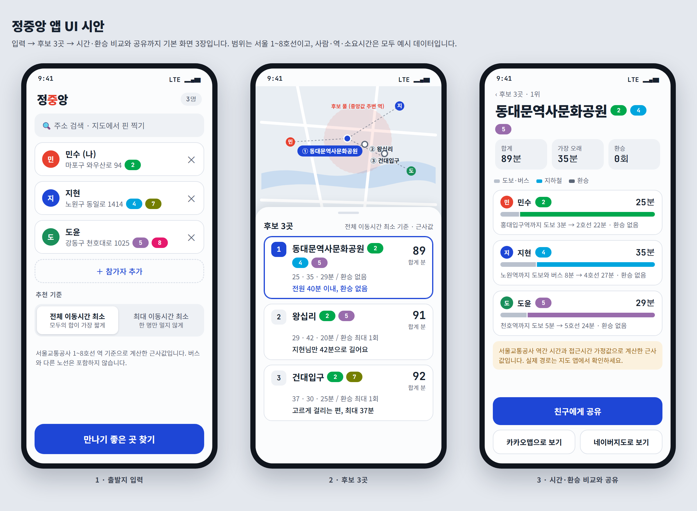

# 정중앙
준하가똥마렵데 - 참 슬픈 일이구나
**서로 다른 곳에서 출발하는 친구들에게, 모두가 납득할 만한 만남 장소를 찾아 주는 안드로이드 앱입니다.**



> 화면 속 사람, 역, 소요시간은 모두 예시입니다. 아직 개발 중이라 앱으로 설치해서 쓸 수는 없습니다. 지금 상태는 [아래](#지금-어디까지-만들었나)에서 확인하세요.

## 이런 때 쓰는 앱입니다

친구 셋이 약속을 잡습니다. 한 명은 홍대, 한 명은 노원, 한 명은 천호에 삽니다. 보통은 지도를 펴서 "대충 중간이 어디지?" 하고 정합니다.

그런데 지도에서 가운데인 곳이 모두에게 가깝다는 보장은 없습니다. 직선거리는 같아도 지하철로는 한 명만 환승을 두 번 하고 한 시간을 가야 할 수 있기 때문입니다.

정중앙은 지도상의 중간이 아니라 **지하철로 실제 얼마나 걸리는지**를 기준으로 장소를 고릅니다. 위 시안에서는 세 사람이 각각 25분, 35분, 29분에 갈 수 있는 곳을 1위로 추천합니다.

## 어떻게 쓰나

1. **출발지 입력**: 한 사람이 참가자 전원의 출발지를 주소 검색이나 지도 핀으로 입력합니다. 그리고 추천 기준을 고릅니다.
   - 전체 이동시간 최소: 모두의 이동시간 합이 가장 짧은 곳
   - 최대 이동시간 최소: 한 명만 너무 멀지 않은 곳
2. **후보 3곳 확인**: 지도와 카드로 후보 3곳이 나옵니다. 카드마다 사람별 시간, 환승 횟수, 왜 이 곳을 골랐는지("전원 40분 이내, 환승 없음")가 붙습니다.
3. **비교하고 공유**: 후보를 열면 사람별로 걷는 구간, 지하철 구간, 환승 구간을 나눠 볼 수 있습니다. 카카오맵·네이버지도로 실제 경로를 확인하고 친구에게 공유합니다.

## 어떻게 계산하나

1. 참가자 좌표들의 기하 중앙값(모든 사람까지의 거리 합이 가장 작은 점)을 구합니다.
2. 그 주변 지하철역을 후보로 뽑습니다.
3. 서울교통공사 공개 데이터로 만든 노선 그래프에서, 사람마다 출발지 근처 역에서 각 후보역까지 걸리는 시간과 환승 횟수를 계산합니다.
4. 고른 기준에 가장 잘 맞는 3곳을 선정 이유와 함께 보여 줍니다.

계산한 시간은 근사값이라 화면에도 그렇게 표시합니다. 한계는 [알아둘 점](#알아둘-점)에 적었습니다.

## 곧 추가할 기능

**초대 링크**: 한 사람이 다 입력하는 대신 링크를 보내면 친구들이 각자 자기 위치를 입력합니다. 식사·카페·술자리 같은 약속 목적으로 장소를 거르는 기능도 넣을 계획입니다.

**책임 알람**: 장소와 약속 시간이 정해지면 사람마다 출발 알람을 자동으로 걸어 줍니다.

> 알람 시각 = 약속 시간 − 그 사람의 이동시간 − 준비 시간

정해진 시간 안에 알람을 끄지 않으면, 같은 약속 멤버 전원의 폰이 울립니다. "○○ 아직 안 일어남" 알림과 함께 알람 끄기 / 전화 걸기 버튼이 뜹니다. 서버가 따로 시간을 재기 때문에 늦잠 잔 사람의 폰이 꺼져 있어도 동작하고, 약속 멤버 전원이 동의했을 때만 켜집니다. 안드로이드에서만 지원합니다. 설계는 [CLAUDE.md](CLAUDE.md)의 "확장: 책임 알람"에 있습니다.

## 지금 어디까지 만들었나

| 상태 | 내용 |
|---|---|
| 완료 | 기하 중앙값 계산, 서울 지하철 1~8호선 그래프(역 240개), 출발 역에서 모든 역까지의 최단시간·환승 탐색, 가까운 역 검색, 접근시간 추정. 단위·통합 테스트 68개 |
| 다음 | 후보 3곳 선정과 점수화, 선정 이유 문구 |
| 그다음 | 안드로이드 화면(입력, 후보, 상세), 지도, 공유 |
| 이후 | 초대 링크, 약속 목적 필터, 책임 알람 |

## 알아둘 점

- **서울교통공사 1~8호선만 지원합니다.** 9호선, 신분당선, 분당선, 경의중앙선, 공항철도는 지원하지 않습니다. 1호선은 서울역~청량리 구간만 포함됩니다.
- **버스는 계산에 넣지 않습니다.** 출발지에서 역까지의 접근 구간만 걷기·버스 가정값으로 추정합니다.
- **소요시간은 근사값입니다.** 공개 데이터의 시간은 정차시간을 뺀 표준 운행시간이라 실제보다 짧게 나올 수 있습니다. 실제 경로는 지도 앱에서 확인하는 걸 권장합니다.
- 안드로이드 전용입니다.

---

## 개발자를 위한 정보

### 기술 스택

| 영역 | 사용 |
|---|---|
| Android | Java(Kotlin 사용 안 함), XML + ViewBinding, MVVM + ViewModel + LiveData, ExecutorService/Handler |
| 지도·주소 | 카카오맵 SDK, 카카오 로컬 |
| 서버 (2단계~) | Spring Boot 3.5 / Java 17, Redis, Docker. 책임 알람부터 RDB(MySQL 또는 Postgres)와 FCM |
| 데이터 | 서울 열린데이터광장 CSV 3종(앱에 번들) |

### 폴더 구조

```
android/app/src/
  main/java/com/jeongjungang/
    domain/model      LatLng
    domain/geo        GeoMedian(기하 중앙값), GeoDistance
    domain/transit    CSV 파서, 지하철 그래프, 최단시간 탐색, 접근시간 추정, 가까운 역 검색
  main/assets/data    번들 CSV (역간 소요시간, 역사 좌표, 환승)
  test/java           단위 테스트와 실제 CSV 통합 테스트
backend/              Spring Boot 뼈대 (2단계 이후 사용)
docs/DATA.md          데이터 출처와 파싱 주의점
docs/mockup, images   UI 시안 HTML과 README용 캡처 이미지
CLAUDE.md             프로젝트 규칙과 설계
```

### 개발 환경

- JDK 17
- 백엔드: `cd backend && ./gradlew build` (Windows는 `gradlew.bat build`)
- 안드로이드: Gradle 프로젝트 파일(`build.gradle`, `AndroidManifest.xml` 등)이 아직 없습니다. Android Studio에서 프로젝트를 만든 뒤 `android/app/src`의 소스를 옮길 예정입니다. 코어 코드는 Android 의존성이 없어서 JUnit4만으로 테스트할 수 있습니다.
- UI 시안 원본은 [docs/mockup/ui-mockup.html](docs/mockup/ui-mockup.html)입니다. 브라우저로 열면 라이트·다크 테마를 볼 수 있고, 위 이미지는 이 파일을 캡처한 것입니다.

API 키(카카오, ODsay, FCM 서버 자격증명 등)는 저장소에 두지 않습니다. 환경변수나 `local.properties`로만 주입하고, 외부 API 키가 필요한 호출은 서버를 거칩니다.

### 로드맵

1. **추천 MVP(앱 단독)**: 코어 로직은 구현 완료. 후보 선정·점수화, 화면, 공유가 남았습니다.
2. **초대 링크, 약속 목적 필터**: 서버 도입(Redis 방 + TTL, 앱 링크, 폴링).
3. **책임 알람**: 서버 도메인과 Redis 에스컬레이션 스케줄러 → 앱 로컬 알람과 풀스크린 울림 → FCM → 이동시간 연동 → 실기기(삼성 포함) 테스트.
4. 후순위: 결제, 장거리, 다른 운영기관 노선.

### 데이터 출처

지하철 데이터는 [서울 열린데이터광장](https://data.seoul.go.kr)의 서울교통공사 제공 자료이며 **공공누리 1유형(출처표시)** 입니다.

- 서울교통공사 역간 거리 및 소요시간 정보
- 서울교통공사 1-8호선 역사 좌표(위경도) 정보
- 서울교통공사 환승역거리 소요시간 정보

기준일과 가공 내용은 [docs/DATA.md](docs/DATA.md)를 보세요.
